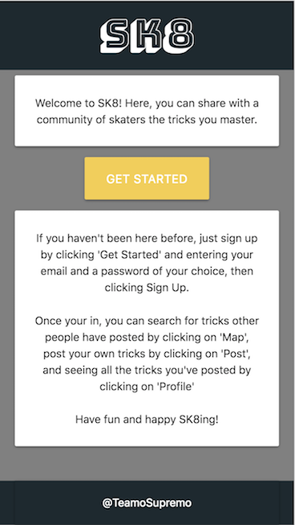
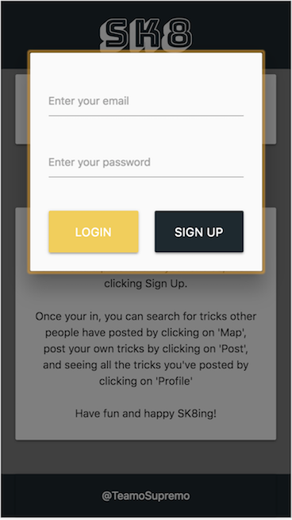
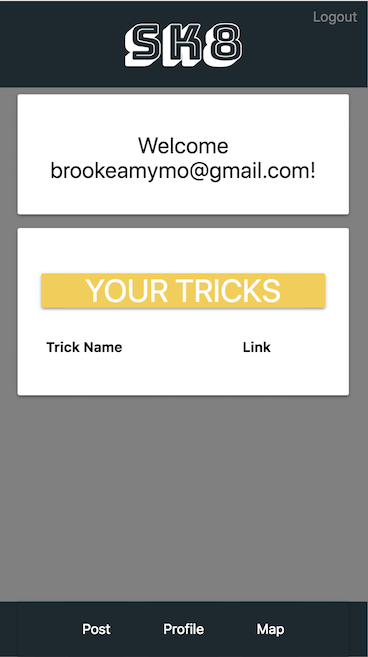
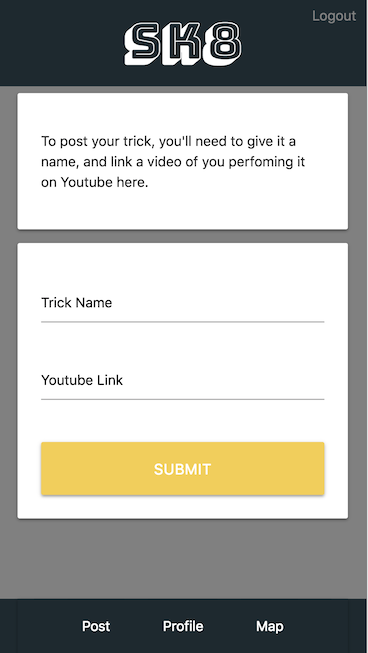
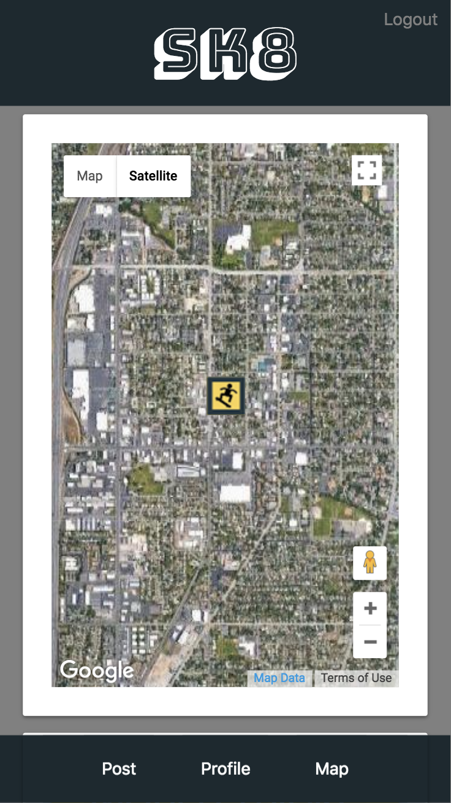

# SK8

A mobile-designed app for skaters, skateboarders, and tricksters to share their tricks with people in their area.
https://stark-savannah-69359.herokuapp.com/

## Using the App

In order to use the app, you'll need to set up an account. Simply put in an email of your choice and a 6-or-more digit password, and click "Sign Up." The page will take you to your <b>profile</b>, where you can navigate to the <b>map</b> page or the <b>post</b> page.

#### Posting a Trick
In order to post a trick, upload it to youtube, and link it on the post page, along with a title. Be sure to be in the place you performed the trick, as that is where the app will log the trick.

#### Using the Map
On the map page, you can zoom in and out to see the tricks that were performed closest to you. Clicking on one will show the name of the trick as well as a link to the Youtube video. You can also see a full list of tricks performed below the map.

#### Viewing your Profile
After you've posted your trick, you can see it on the map page, as well as listed under "Your Tricks" on your Profile page.

#### Logging Out
At anytime, you can log out by simply pressing "Logout" in the top right corner.

## Development Team

###### Isaac Pehrson | Back End Developer
https://github.com/IzzleNizzle

###### Brooke Mortensen | Front End Developer / Design and User Authentication
https://github.com/BrookeMo

###### Melinda Richards | Front End Developer / Google Maps API
https://github.com/melindarichards

### Technologies Used

-HTML
-CSS
-Materialize
-Javascript
-Node.js
-jQuery
-Geolocation API
-Google Maps API
-MySQL
-JSON
-Firebase
-Postman

## Pictures and Examples

###### Home Page

